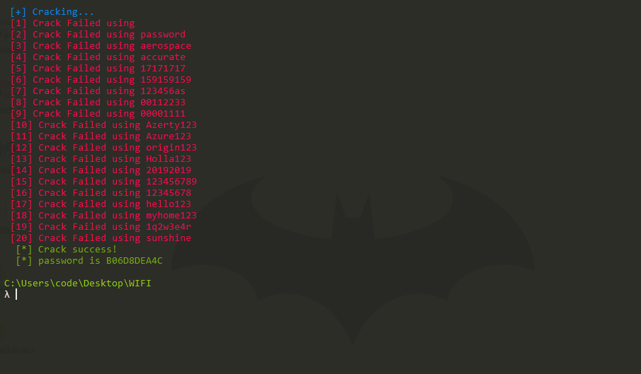

<h1 align="center">
   
  WIFI-Brute-Force
   
   
  
   
  VulnX
   
</h1>

### _🕷️ Available command line options_
[`READ WIKI`](https://github.com/BrahimJarrar/vulnx/)

    usage: vulnx [options]
      -h , --help           show this help message and exit
      -s , --ssid           SSID WIFI Target
      -w , --wordlist       list of passwords
      -t , --threads        number of threads #Comming soon
      -v , --version        version

-------------------------------------
